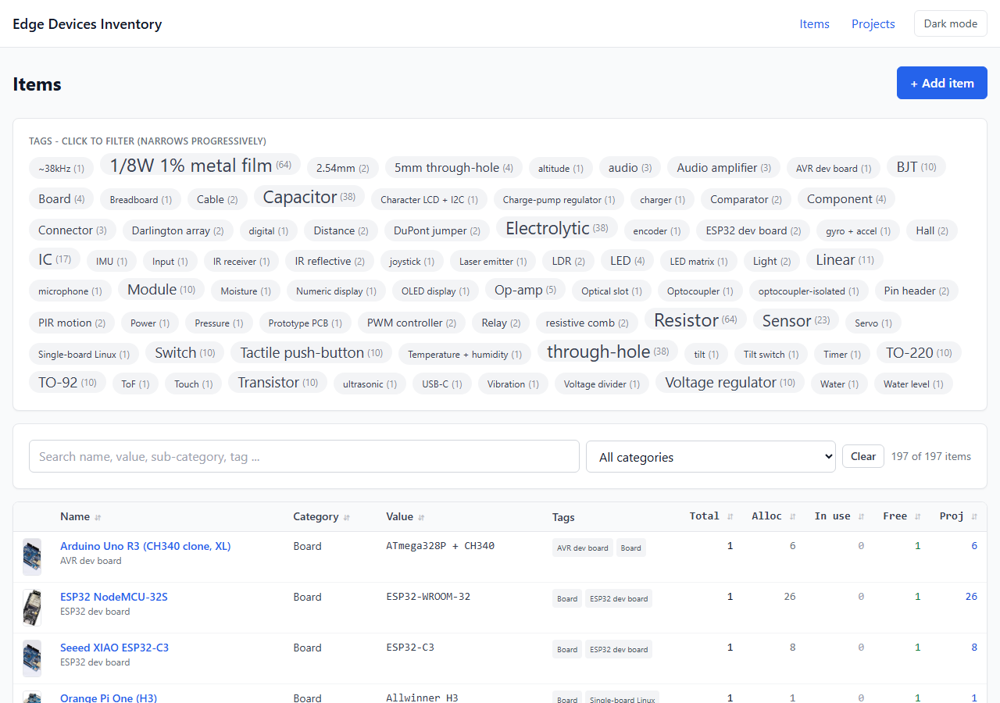
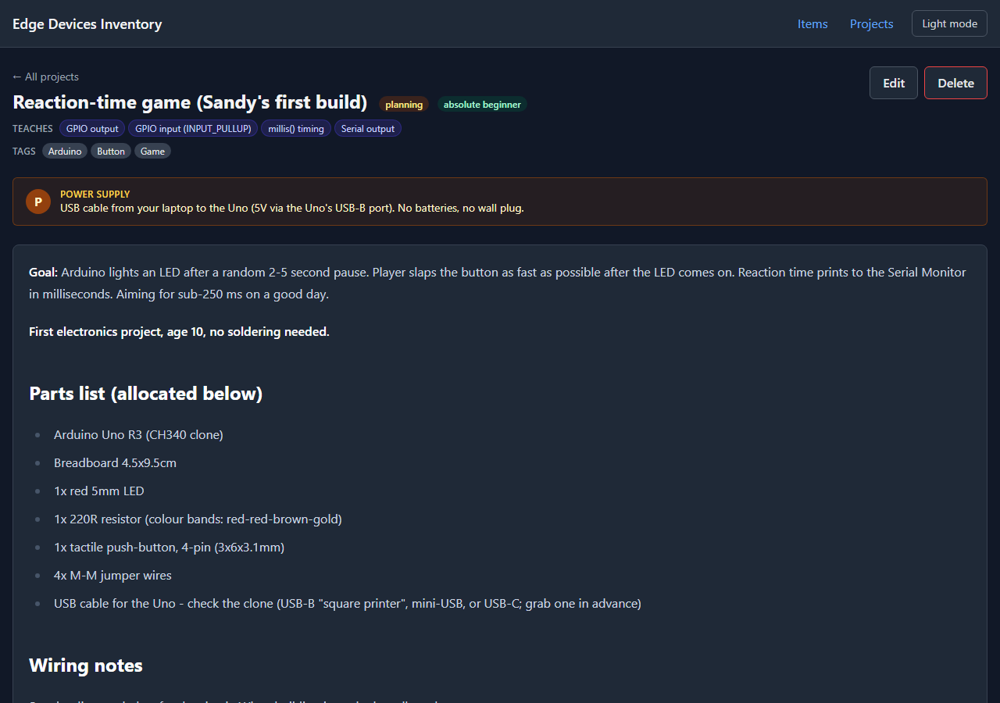
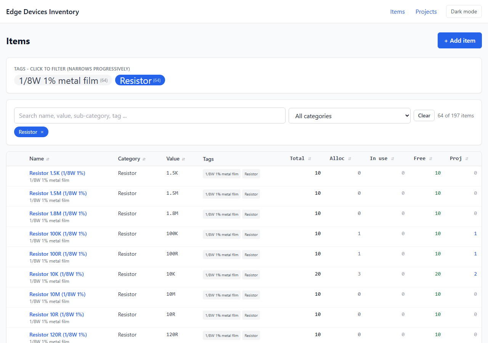
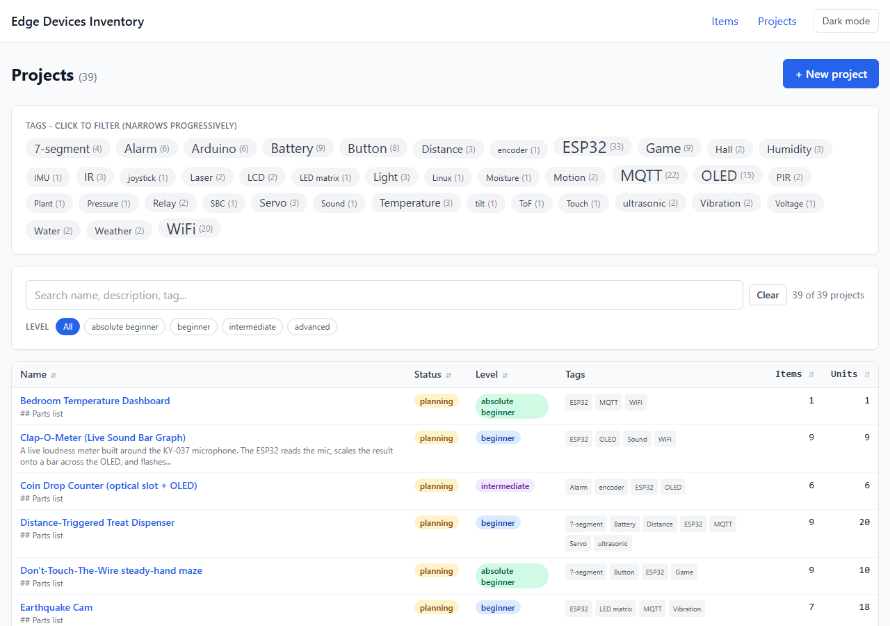
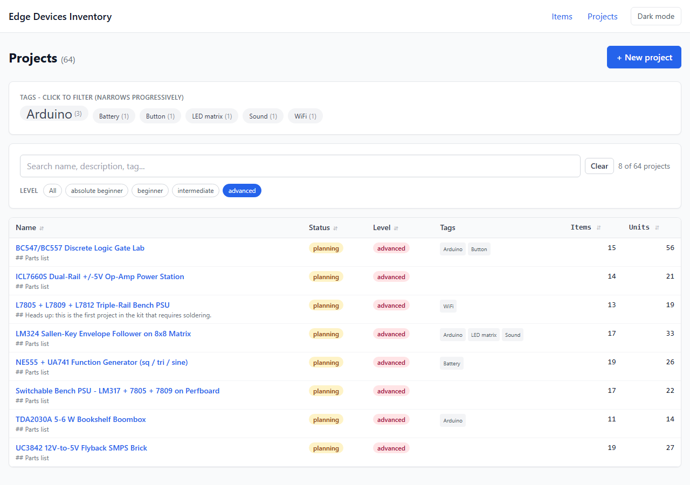
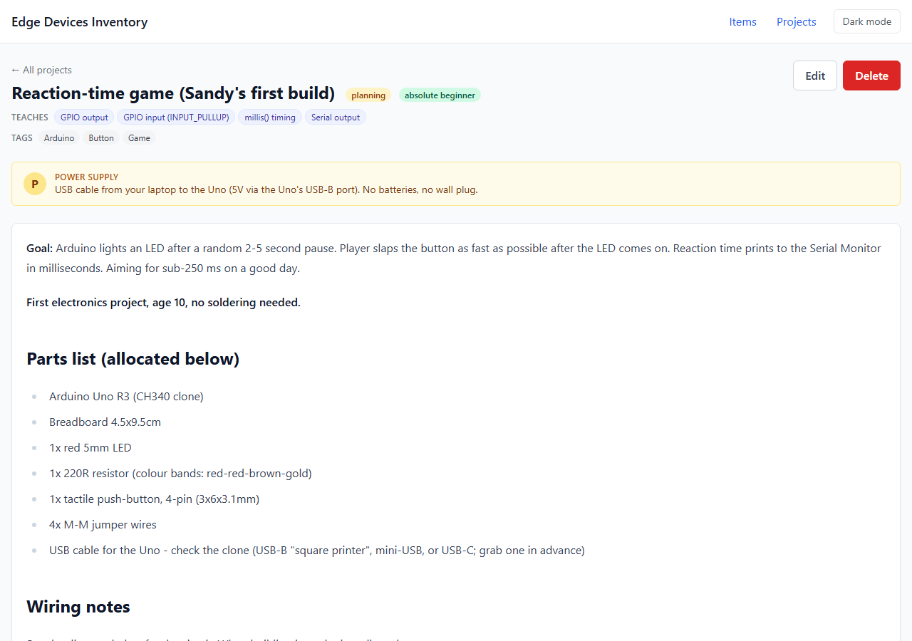

# Edge Devices Inventory

A tiny PHP + MariaDB app for tracking a hobby electronics inventory and curating beginner-friendly Arduino / ESP32 project records against it. Built to teach a parent and his 10-year-old son, with an AI-powered project generator that produces complete, runnable project write-ups (wiring + code + parts list).

Ships with **197 inventory items** across 12 categories and **56 example projects** spanning absolute-beginner LED games, NE555 timer recipes, op-amp comparator dark detectors, ESP32 + WiFi mini web pages, soil-moisture plant monitors, IR / ultrasonic / hall / PIR sensor showcases, and other kid-friendly builds. Strictly no-soldering - everything works on the breadboard.





## Highlights

- **Inventory page** with a faceted progressive-narrow tag cloud, live search, sortable columns, dark mode, and a `Used in N projects` panel on each item's edit form.

  

- **Projects page** with a tag cloud, difficulty pills, live search, and sortable columns - all bookmarkable via URL state.

  

  

- **Project records** as full curriculum entries: amber power-supply callout, markdown description (rendered via marked.js + Tailwind typography), Mermaid wiring diagram with a green power-source node, syntax-highlighted code block (hover-to-copy), difficulty + concept badges, and an allocations table linking back to inventory.
- **Dark mode** with `localStorage` preference, `prefers-color-scheme` fallback, no flash on load.

  

- **Multi-agent project generator** that brainstorms, critiques, refines, and judges new projects against your actual inventory. See [AGENTS.md](AGENTS.md).

## Stack

| Layer         | Choice                                                             |
| ------------- | ------------------------------------------------------------------ |
| Backend       | PHP 8.2+, no framework, no Composer                                |
| Database      | MariaDB 10.4+ / MySQL 8.0+                                         |
| CSS           | Tailwind via Play CDN (no build step)                              |
| Page-level JS | marked.js, highlight.js, mermaid.js (CDN-loaded only where needed) |
| Server        | Anything that runs PHP - Apache + mod_php, nginx + php-fpm, etc.   |

Self-contained, no `vendor/`, no `node_modules`, no build pipeline.

## Quick start

### Option A: Docker (recommended)

```bash
git clone https://github.com/andyg2/Sandys-Electronics.git
cd Sandys-Electronics
cp .env.example .env          # optional, edit credentials
docker compose up -d
```

Wait ~10 seconds for the DB to come up and seed. Then open <http://localhost:8080>.

The first start runs `seed.php` and loads `inventory/examples/projects.json` (56 projects) automatically. Subsequent starts are no-ops. To wipe and re-seed: `docker compose down -v && docker compose up -d`.

### Option B: Native PHP + MariaDB

```bash
git clone https://github.com/andyg2/Sandys-Electronics.git
cd Sandys-Electronics
bash setup.sh
```

`setup.sh` checks for PHP 8.2+ and the `pdo_mysql` extension, creates `inventory/src/config.php` from the example, creates the database if it doesn't exist, runs the seed, and optionally loads the 56 example projects.

After it finishes, point a web server at `inventory/public/` or run the PHP built-in server:

```bash
make serve     # equivalent to: php -S localhost:8080 -t inventory/public
```

### Verify

```bash
make test                                # runs against https://inventory.local
bash tests/smoke.sh http://localhost:8080
```

Smoke tests cover every route, asset, filter URL state, and 404 path - 24 checks total.

## Common tasks

```bash
make help          # list all targets
make setup         # full first-time setup (interactive)
make seed          # (re)create schema + load 197 example inventory items
make empty         # (re)create schema with no inventory rows
make examples      # load 56 example projects into existing schema
make test          # smoke tests
make serve         # PHP built-in server at localhost:8080
make docker-up     # docker compose up -d
make docker-down   # docker compose down
make clean         # clear inventory/public/uploads/
```

## File layout

```
.
  README.md              Project overview (this file)
  AGENTS.md              Project authoring contract for AI agents
  CONTRIBUTING.md        Dev environment + PR checklist
  CHANGELOG.md           Notable changes
  LICENSE                MIT
  Makefile               Common tasks
  setup.sh               One-command setup
  docker-compose.yml     Docker stack: MariaDB + php-apache
  docker/                Dockerfile + Apache config + init.sh
  .env.example           Compose overrides

  inventory/
    seed.php             Schema + 197-item seed
    examples/
      inventory.json     197 items as JSON (round-trip with _export/_import)
      projects.json      56 example projects with allocations + tags
    _generate_inventory_snapshot.php   Text snapshot for workflow agent prompts
    _insert_generated_projects.php     Load a projects JSON into MariaDB
    _export_inventory.php              Export items to JSON
    _import_inventory.php              Import items from JSON
    public/                            Web root
      index.php          303 -> /items.php
      items.php, item.php, item_edit.php, item_delete.php
      projects.php, project.php, project_edit.php, project_delete.php
      allocate.php, return_allocation.php
      .htaccess.example  Optional HTTP Basic Auth template
      assets/            style.css, inventory.js, projects.js, project_render.js
      uploads/           Item images (gitignored)
    src/                 Shared PHP includes
      bootstrap.php, db.php, helpers.php, header.php, footer.php
      config.example.php   Committed; copy to config.php (gitignored)
    workflows/
      generate_projects.workflow.js
      generate_ic_projects.workflow.js / .template.js
      fill_gaps.workflow.js / .template.js
      add_openers.workflow.js / .template.js

  tests/
    smoke.sh             24 checks; takes ~5 seconds
    screenshots.py       Playwright script to refresh docs/screenshots

  docs/
    screenshots/         PNGs used in this README
```

## Configuration

The app reads database credentials from `inventory/src/config.php` (gitignored). On first run, `setup.sh` and the docker init script both create it from `config.example.php`.

Environment variables override config-file values when set:

| Env var       | Default       |
| ------------- | ------------- |
| `DB_HOST`     | `localhost`   |
| `DB_PORT`     | `3306`        |
| `DB_DATABASE` | `edgedevices` |
| `DB_USER`     | `root`        |
| `DB_PASSWORD` | (empty)       |

That makes Docker, CI, and `.env` overrides all work without code edits.

## Schema summary

- `items` - id, name (UNIQUE), category, subcategory, value, qty_total, image_path, notes, added_at
- `projects` - id, name (UNIQUE), description (markdown), wiring_diagram (mermaid), code, code_language, power_supply, difficulty, learning_concepts (JSON), status, created_at
- `allocations` - id, item_id, project_id, qty, notes, created_at. `UNIQUE (item_id, project_id)`, FK CASCADE on both
- `tags` - id, name, slug (UNIQUE), created_at
- `item_tags`, `project_tags` - join tables, FK CASCADE on both sides

Detailed contract for project authoring lives in [AGENTS.md](AGENTS.md).

## Bring your own inventory

The 197 example items are Andy's specific kit. To swap in your own:

```bash
# 1. Schema only, no example items
cd inventory && php seed.php --empty

# 2. Add items via the web UI, OR import from a JSON file:
php _import_inventory.php /path/to/your-kit.json
```

Format of your JSON: see `inventory/examples/inventory.json` for the schema.

## Generating new projects with AI agents

The `inventory/workflows/` directory ships two complete multi-agent workflows:

- **`generate_projects.workflow.js`** - six brainstorm lenses fan out in parallel; a shortlist agent picks ~25; each candidate pipelines through Author -> Critique -> Refine; a judge selects the final 20 for variety.
- **`fill_gaps.workflow.template.js`** - targets specific uncovered boards / sensors / modules; three-stage Author -> Critique -> Refine pipeline per target.

These are designed for [Claude Code](https://docs.claude.com/) and assume Anthropic API access. See [AGENTS.md](AGENTS.md) for how to run them and what conventions agents must follow.

## Security

The app was built for a private home network. Before exposing it publicly:

- **Change DB credentials** in `inventory/src/config.php` (or via env vars).
- **Add authentication** - the app has none. `inventory/public/.htaccess.example` documents the simplest gate (HTTP Basic Auth via `.htpasswd`).
- **Add CSRF tokens** to the POST handlers.
- **Turn off** `display_errors` in `inventory/src/bootstrap.php`.
- **Tighten upload validation** in `item_edit.php` beyond extension + size checks.

## Contributing

See [CONTRIBUTING.md](CONTRIBUTING.md). The TL;DR: read [AGENTS.md](AGENTS.md), pass `make test`, no em dashes.

## License

MIT - see [LICENSE](LICENSE).
